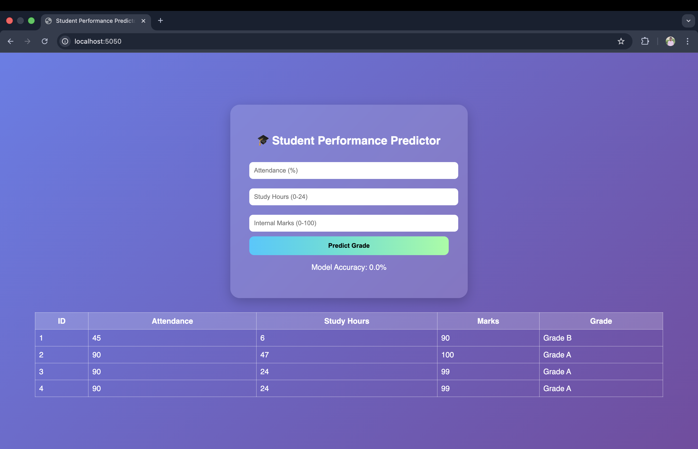
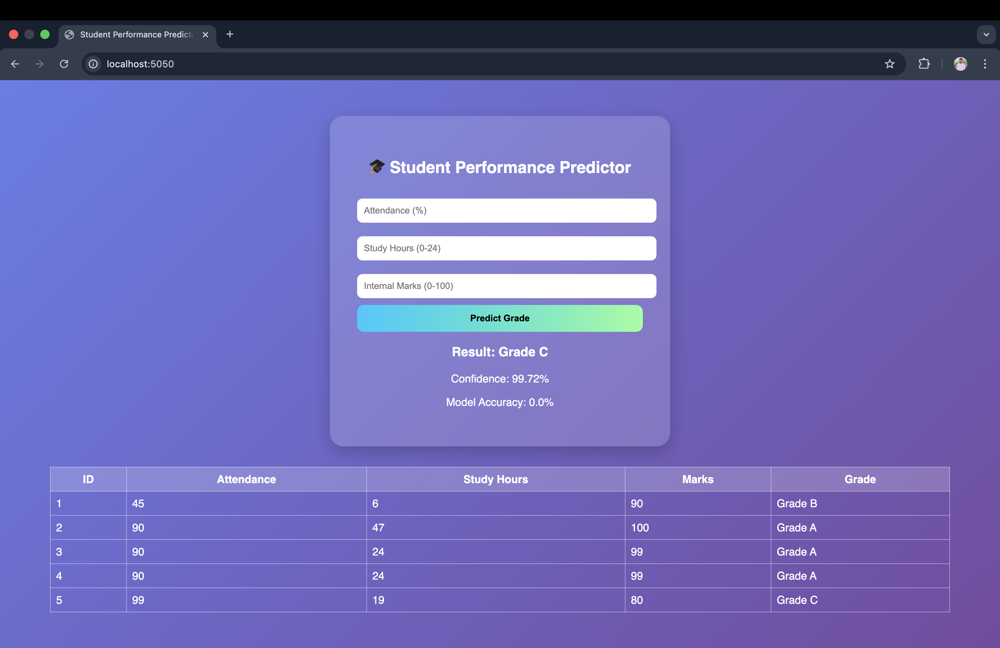

# 🎓 Student Performance Prediction System (Full Stack ML App)

## 📌 Overview
This project is a Full Stack Machine Learning Web Application that predicts student grades based on:

- Attendance (%)
- Study Hours
- Internal Marks

The system uses Logistic Regression for prediction and stores results in a MySQL database.

---

## 🚀 Tech Stack
- Python
- Flask
- Scikit-learn
- MySQL
- HTML & CSS
- Git & GitHub

---

## 🧠 Features
- Grade Prediction (A, B, C, D, Fail)
- Confidence Percentage
- Model Accuracy Display
- Input Validation (Frontend + Backend)
- MySQL Database Integration
- Prediction History Table
- Secure Password Handling using Environment Variables

---

## ▶️ How to Run Locally

1. Clone the repository
```
git clone https://github.com/AP24110011508/student-performance-prediction-ml.git
```

2. Navigate to project folder
```
cd student-performance-prediction-ml
```

3. Install dependencies
```
pip install -r requirements.txt
```

4. Set environment variable
```
export DB_PASSWORD="your_mysql_password"
```

5. Run the app
```
python app.py
```

6. Open in browser
```
http://localhost:5050/
```

---

## 📊 Model Used
- Logistic Regression
- Train/Test Split
- Accuracy Evaluation

---
## ⚙️ How to Run This Project

git clone https://github.com/AP24110011508/student-performance-prediction-ml.git  
cd student-performance-prediction-ml  
pip install -r requirements.txt  
export DB_PASSWORD="your_mysql_password"  
python app.py

## 📸 Project Screenshots



## 👨‍💻 Author
Charan
